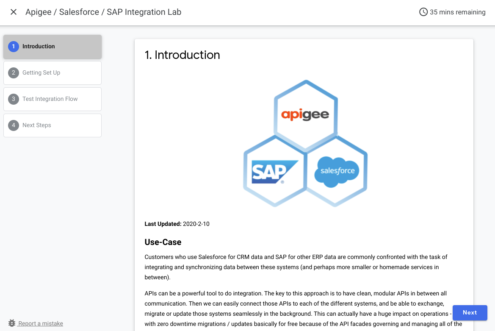
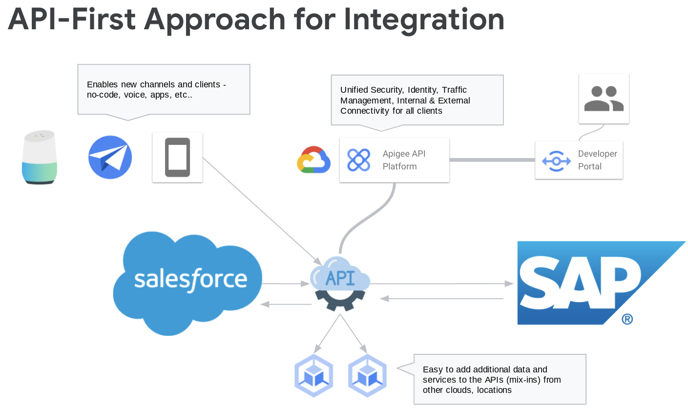
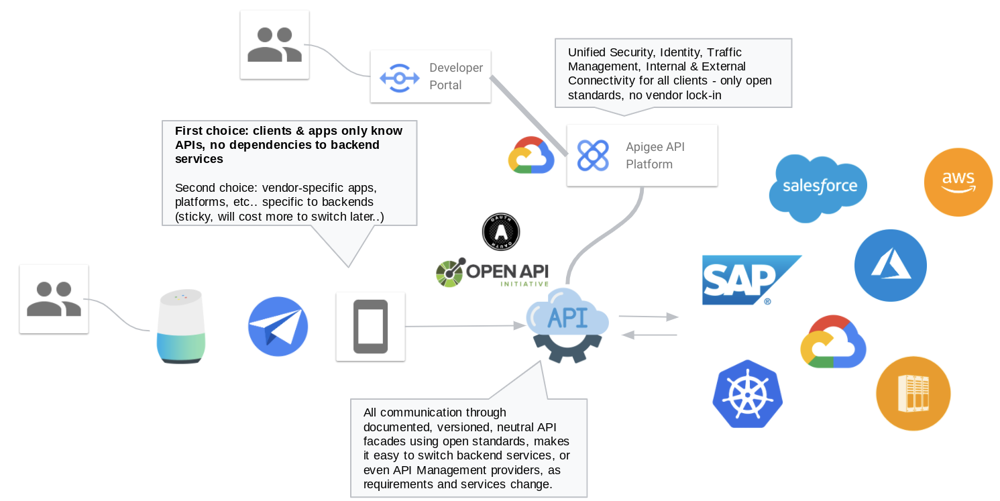

# Apigee / Salesforce / SAP Integration Lab

This lab shows how to integrate complex systems using an **API-First** approach, utilizing easy-to-consume API facades in Apigee API Management to connect to a backend SAP interface.  This makes the integration much easier for frontend systems like Salesforce and other apps and services needing to integrate with backend data.

## [Start the lab](https://tyayers.github.io/apigee-sfdx-sap-lab)

## Background

We call this approach **API-First** because it puts the canoncial APIs as the central connectivity channel for all integration.  This allows us to have centralized security, identity, traffic management and many other useful policies in place that makes life easier for both internal and external teams (consistency scales).  We are also much more flexible in the future to exchange, migrate or update backend systems, because there are no hard dependencies to clients.

The flow covered in this lab is the creation of Account records in Salesforce, and automatically syncronizing them through a canonical CUSTOMER API to the backend SAP Business Partner ODATA API.  The new CUSTOMER API can then easily be leveraged for additional clients and tasks.

This approach can be generalized and applied to all integrations with backend systems - an **API-First** approach to integration is a great strategy to gain more freedom and reduce sticky dependencies in your service and app landscape.

## References

* [SAP BusinessPartner OData Mock Project](https://github.com/tyayers/sap-businesspartners-mock)
* [SAP SalesOrder OData Mock Project](https://github.com/tyayers/sap-salesorders-mock)

Comments, suggestions and feedback are welcome in the Issues.